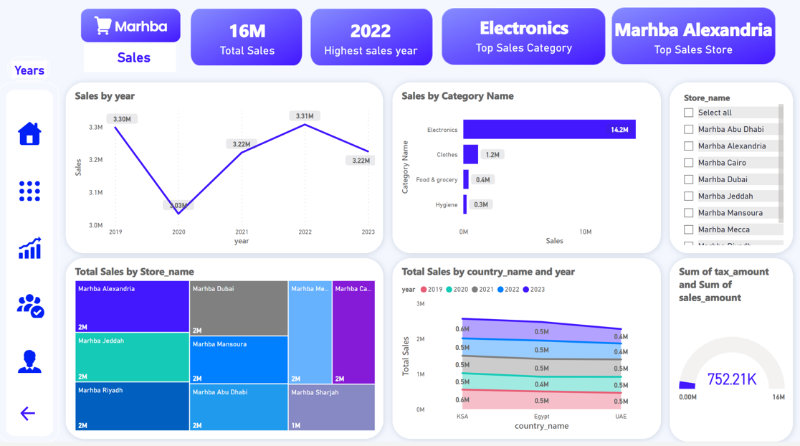

<!-- PROJECT TITLE -->
<h1 align="center">Marhba
Hypermarket Analysis </h1>

<!-- HEADER -->

  

<!-- PROJECT OVERVIEW -->
##  **➲ Project overview**
This project centers around a meticulous analysis Marhba database is a comprehensive system for storing and managing data related to various aspects of hypermarket operations. It comprises multiple tables that capture detailed information about products, customers, employees, suppliers, Departments, and other relevant entities. This database plays a crucial role in supporting and streamlining hypermarket operations by facilitating efficient data retrieval, analysis, and reporting.
##  **➲ Prerequisites**
This is list of required tools for the project to be installed :
* <a href="https://www.microsoft.com/en-us/download/office" target="_blank">Microsoft Office</a>
 <a href="https://powerbi.microsoft.com/en-us/downloads/" target="_blank">Microsoft Power Bi</a>

* Dashboard
The project encompasses a dynamic dashboard, harmonizing the three pivot tables and integrating slicers for seamless data filtering.

<!-- CONTACT -->
##  **➲ Contact**
- E-mail   : [mohamedahmedabdlatif2@gmail.com](mailto:mohamedahmedabdlatif2@gmail.com)
- LinkedIn : www.linkedin.com/in/mohamed-abdlatif
